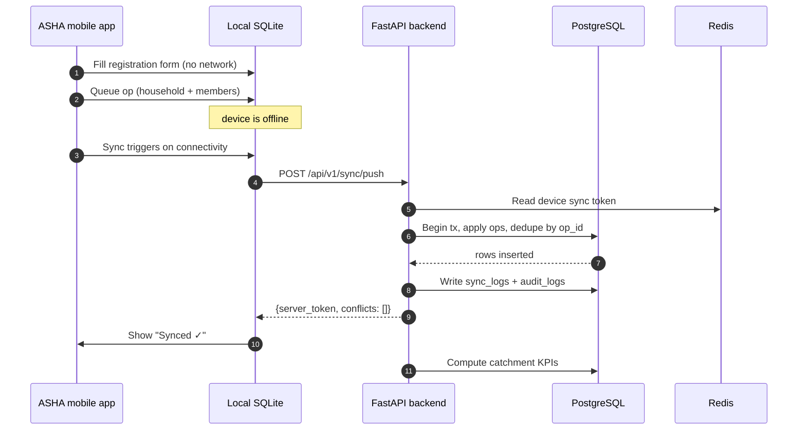
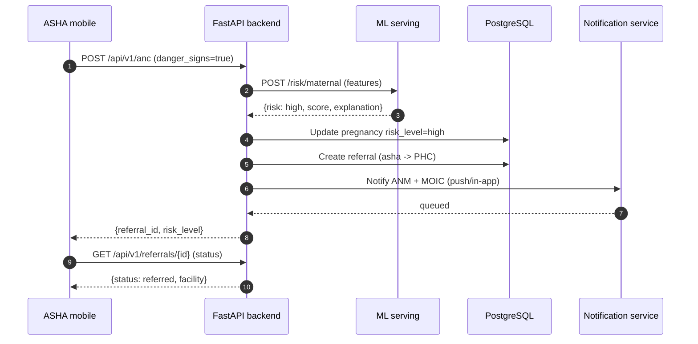
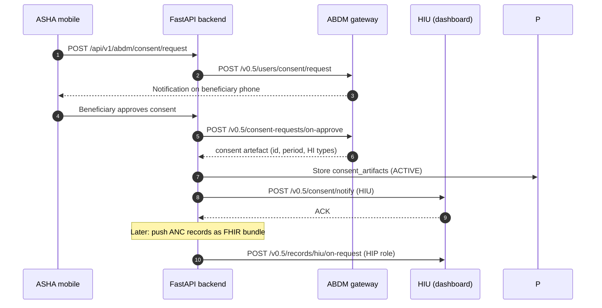
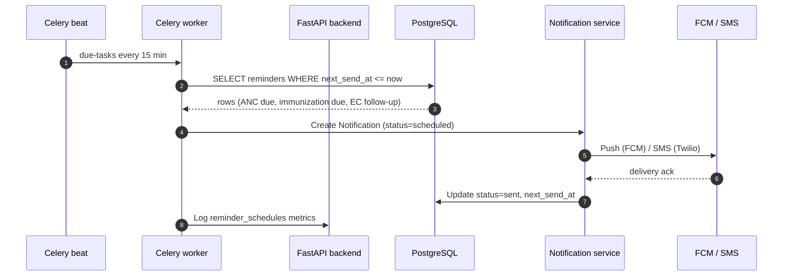

# ASHA Sathi - System Design

This document describes the end-to-end architecture of the ASHA Sathi platform:
system layers, application modules, data flows and sequence diagrams.

---

## 1. System layers

ASHA Sathi is organised into five layers:

```
┌─────────────────────────────────────────────────────────────────────────────┐
│  USER LAYER                                                                 │
│   Flutter ASHA app · Flutter Patient app · Flutter PHC Admin app            │
│   React dashboard (web-dashboard)                                           │
├─────────────────────────────────────────────────────────────────────────────┤
│  APPLICATION LAYER                                                          │
│   FastAPI backend (/api/v1) · ML inference service · Celery workers         │
│   Auth & RBAC · Offline sync engine · ABDM connector · Notifications        │
├─────────────────────────────────────────────────────────────────────────────┤
│  DATA LAYER                                                                 │
│   PostgreSQL 16 (primary) · Redis 7 (cache/queues) · Object storage         │
│   Supabase optional (PostgREST, Realtime, Auth, Storage)                    │
├─────────────────────────────────────────────────────────────────────────────┤
│  INTEGRATION LAYER                                                          │
│   ABDM gateway (ABHA/consent/HIR) · Twilio SMS · FCM push ·                │
│   RCH / Ni-kshay exports · model registry (MLflow)                          │
├─────────────────────────────────────────────────────────────────────────────┤
│  INFRASTRUCTURE LAYER                                                       │
│   Docker Compose (dev) · Kubernetes + Helm (staging/prod) · nginx ingress   │
│   Prometheus + Grafana + Loki + Tempo · GHCR · GitHub Actions CI/CD         │
└─────────────────────────────────────────────────────────────────────────────┘
```

### 1.1 User layer

| Surface         | Audience                                | Tech             |
| --------------- | --------------------------------------- | ---------------- |
| `mobile-asha`   | ASHA workers (field data capture)       | Flutter          |
| `mobile-patient`| Beneficiaries (self-service, records)   | Flutter          |
| `mobile-phc-admin` | ANM / MOIC / PHC staff               | Flutter          |
| `web-dashboard` | Block/district/state supervisors        | React + Vite     |

The mobile apps are **offline-first**: all screens read/write a local SQLite store
and enqueue mutations for later sync. The dashboard is online-only.

### 1.2 Application layer

A single FastAPI service exposes versioned REST endpoints under `/api/v1` grouped
by module (see §2). Celery + Redis handle background work: reminder scheduling,
incentive batch processing, ABDM webhook callbacks and sync job coalescing.
A small ONNX runtime service (`ml-serving`) scores risk models.

### 1.3 Data layer

- **PostgreSQL 16** is the system of record (SQLAlchemy 2.0 async + Alembic migrations).
- **Redis 7** backs sessions, rate limiting, the Celery broker/result store and
  sync "device delta" cursors.
- **Object storage** holds uploaded documents/PDFs; the local Supabase stack uses
  a MinIO-compatible volume, production uses S3.
- **Supabase** is optional: Realtime is used for live dashboard updates and
  GoTrue for auth when enabled. FastAPI remains the source of truth for RBAC.

### 1.4 Integration layer

ABDM (ABHA creation, consent artefacts, health-information push/pull via FHIR),
Twilio for OTP/SMS, FCM for push, and periodic exports for state programs.

### 1.5 Infrastructure layer

See [deployment/deployment.md](deployment/deployment.md) and the `docker/`
directory. Everything is containerised, monitored, and deployed by GitHub Actions.

---

## 2. Application modules

The backend exposes the following 14 modules under `/api/v1`:

| # | Module        | Router           | Responsibilities                                          |
| - | ------------- | ---------------- | --------------------------------------------------------- |
| 1 | **Auth**      | `/auth`          | OTP login, refresh tokens, biometric device registration, RBAC |
| 2 | **ASHA**      | `/asha`          | ASHA profiles, catchment, training, supervision           |
| 3 | **Households**| `/households`    | household registration, family census, consent            |
| 4 | **Beneficiaries** | `/beneficiaries` | person registration, demographics, ABHA linkage        |
| 5 | **Maternal**  | `/pregnancies`, `/anc`, `/pnc`, `/deliveries` | pregnancy tracking, ANC/PNC visits, delivery outcomes, micro birth plans |
| 6 | **Child**     | `/children`, `/immunization`, `/growth` | children, immunization schedule, HBNC/HBYC, growth |
| 7 | **NCD**       | `/ncd`           | CBAC screening, diabetes/hypertension risk, referrals    |
| 8 | **Disease**   | `/disease`       | malaria / TB / fever case reporting, MDA tracking        |
| 9 | **Deaths**    | `/deaths`        | death reporting, verbal autopsy, maternal/child flags    |
| 10| **Incentives**| `/incentives`    | claim creation, verification, approval, payments, PDFs   |
| 11| **ABDM**      | `/abdm`          | ABHA create/link, consent request/handle, HIR push/pull  |
| 12| **Sync**      | `/sync`          | offline-first push/pull batches, conflict resolution     |
| 13| **Dashboard & Reporting** | `/dashboard`, `/reporting` | aggregates, exports (CSV/PDF), program indicators |
| 14| **Notifications, Referrals, Config, AI** | `/notifications`, `/referrals`, `/config`, `/ai` | reminders, referrals, app config, ML predictions |

Supporting cross-cutting services: `audit_logs` (every mutation), `sync_logs`
(per-device sync tracing) and `app_configs` (feature flags).

---

## 3. Data flows

### 3.1 Offline-first sync flow

```
Mobile device                        Backend                    PostgreSQL / Redis
-----------                          --------                    ----------------
  ┌──────────────┐
  │ local SQLite │  every mutation writes a queue row (op_id, table, pk)
  └──────┬───────┘
         │  background worker triggers
         │  POST /api/v1/sync/push   {since_token, ops: [...]}
         │ ──────────────────────────►  validate auth + device
         │                             begin transaction
         │                             for each op:
         │                               - if table.updated_at <= local version -> apply
         │                               - else -> record conflict in sync_logs
         │ ◄────────────────────────── {server_token, conflicts: [...]}
         │  resolve client-side conflicts (last-write-wins + audit)
         │
         │  GET /api/v1/sync/pull?since_token=...
         │ ──────────────────────────►  fetch changed rows (updated_at > token)
         │ ◄────────────────────────── {changes, next_token}
         │  apply to SQLite, update local watermark
```

Design points:

- Ops are idempotent (`op_id` stored per device, deduped on the server).
- A per-device `sync_token` (Redis-backed cursor) makes pull incremental.
- Conflicts never silently win: they are logged in `sync_logs`, surfaced to the
  dashboard, and resolved with a documented policy (see below).
- Sync runs over HTTPS with the compact `orjson` payloads; batches are ≤ 500 ops.

**Conflict policy:** default `last-write-wins` on `updated_at`; for beneficiary
identity fields (name/phone/ABHA) a server-side merge is attempted and, if
impossible, the record is flagged `needs_review`.

### 3.2 ANC visit flow

1. ASHA opens the beneficiary's pregnancy record (offline data if no network).
2. Taps **Record ANC visit**, fills vitals (BP, weight, Hb, danger signs).
3. Form is saved locally → task `anc_visit` marked done.
4. On sync, the visit is pushed; backend recomputes:
   - `pregnancy.anc_count`, `last_anc_date`, `next_anc_due`
   - maternal-risk score (via `/ai/risk` if eligible)
   - KPI counters (`asha_kpis.anc_visits`)
5. If danger signs → auto-create a high-risk referral + notification to ANM/MOIC.
6. If due date is today+ → schedule a reminder notification (Celery beat).

### 3.3 Incentive claim flow

1. Monthly cron aggregates ASHA KPIs into a draft `IncentiveClaim` per ASHA.
2. ASHA reviews and submits from the app; `status=draft → submitted`.
3. ANM/MOIC verifies via dashboard → `approved`/`rejected` (+ `review_notes`).
4. Finance batch processes approved claims → `paid` with `payment_reference`.
5. PDF receipts are generated and stored; push notification confirms payment.

### 3.4 ABHA creation flow

1. ASHA registers a household/beneficiary and asks for ABHA consent.
2. App calls `POST /api/v1/abdm/abha/create` (M1) with name/phone/DOB/gender.
3. Backend calls the ABDM gateway: verify mobile → gateway pushes OTP.
4. User submits OTP → backend finalises ABHA number → `abha_records` created
   with `kyc_status=pending`.
5. Aadhaar KYC (Aadhaar + mobile OTP) upgrades `kyc_status=verified`.
6. Consent (M2) and health-record push (M3) follow the flow in §5.

---

## 4. Sequence diagrams

### 4.1 ASHA registration (offline → sync)



### 4.2 High-risk referral



### 4.3 ABDM consent + record push



### 4.4 Notification reminder cron



---

## 5. Consistency & guarantees

- **Transactions:** every multi-table write runs in a single DB transaction.
- **Idempotency:** sync ops and ABDM webhooks are idempotent via `op_id` /
  gateway `request_id`.
- **Sync latency:** best-effort push on connectivity; pull is incremental.
- **Audit:** all mutations append to `audit_logs` (actor, ip, device, diff).
- **Backups:** nightly `pg_dump` to `backups/` + S3 (see `scripts/backup.sh`).
